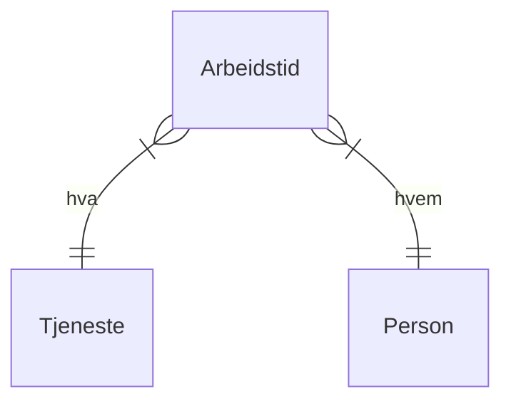

# Oppgave

UiB har [en katalog](https://ntk.app.uib.no) over alle tjenestene som tilbys våre brukere. Denne katalogen har et åpent API som er tilgjengelig fra `https://gw-uib.intark.uh-it.no/tk-topdesk/svc.json`.  Feltene som er tilgjenglig for hver tjeneste er beskrevet [her](https://api-uib.intark.uh-it.no/catalog/api/3bf4bb7a-c730-4ccf-b4bb-7ac730fccfec/doc?page=6df2205f-2c06-4ef0-b220-5f2c060ef0a5#get-httpsgw-uibintarkuh-itnotk-topdesksvcjson).

Teamleder Karianne ønsker seg et program som henter ut tjenestene som tilhører teamet sitt (Læringmiljø-teamet) og lagrer dette i en relasjonsdatabase.  For hver tjeneste ønsker hun at personene i Teamet skal kunne registrere hvor mange timer de har arbeidet i uka på hver enkelt tjeneste.

Skriv et program som henter ned disse dataene og filterer ut tjenestene hvor `meta.archived == false` og hvor `operatorgroup_firstline` eller `operatorgroup_secondline` har verdien `"IT- Digitalt læringsmiljø"`.  Deretter skal det skrive dataene til en database med følgende struktur:

Beskriv en database i SQL som kan brukes til dette formålet.

Bruk helst PHP eller Python til å skrive programmet som oppretter databasen og fyller det med tjenester. Personene i teamet kan du anta at du har tilgjenglig i en CSV-fil. Bruk SQLite som database. Når programmet kjøres om igjen så skal det oppdatere databasen, slik at tjenester som er kommet til blir opprettet og tjenester som er avviklet eller forsvunnet blir markert som det.

Skisser et web-grensesnitt som kan brukes til å registrere timer.

Forklar hovedstrukturene i HTML og CSS som implementerer dette grensesnittet.

Hvordan vil du koble sammen web-gresesnittet og databasen?
